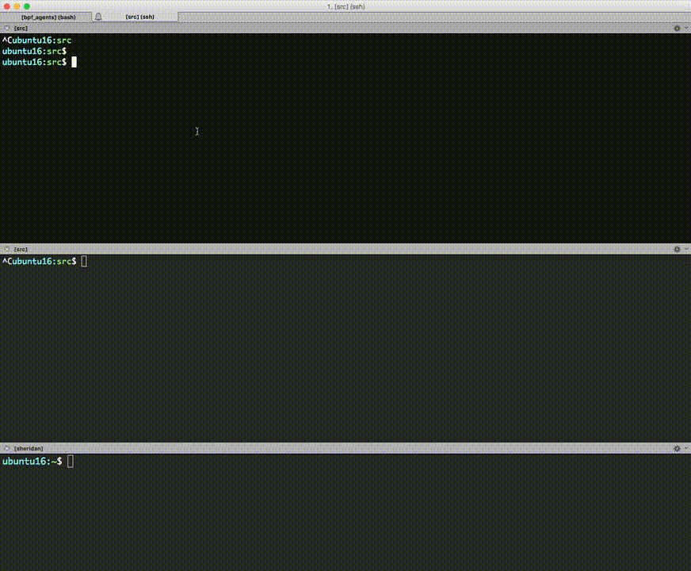

# SysStream - Network traffic + OS context

*The missing top + netstat for Wireshark*

SysStream captures all system calls involving network traffic, along with accompanying operating system-level data such as socket file descriptors, source and destination addresses, user and process ID of sending and receiving application, and other CPU information.  This uses advances in Linux profiling through the extended Berkeley Packet Filter (eBPF), "bytecode virtual machine" for the kernel, providing:

 * Real-time dependency map of which applications on specific hosts are communicating with other ones.
 * Send and receive timestamps for all bytes sent and received on the wire,
 * OS-level statistics including user and group ID’s, process trees, open files and sockets, information for each byte sent over the network.




## How to use

This example traces a wget request to an Apache2 webserver.

```Shell
# ./sys_stream.py -d -t --net --comm wget
TIME(s)  FUNC                 PID      COMM     PPID         PCOMM        SOCKFD LEN    Notes
0.0000   socket               18423  wget         18422  sudo                family:AF_INET, flags:0001
0.0000   socket_RETURN        18423  wget         18422  sudo         3
0.0003   connect              18423  wget         18422  sudo         3       -> 127.0.0.1:80
0.0005   tcp_v4_connect_RETURN 18423  wget         18422  sudo         0      127.0.0.1:57032 -> 127.0.0.1:80
0.0007   write                18423  wget         18422  sudo         3      Sending 146 bytes
0.0024   recvfrom             18423  wget         18422  sudo         3      Receiving <= 511 bytes...
0.0026   recvfrom_RETURN      18423  wget         18422  sudo         3      511 bytes received
0.0028   read                 18423  wget         18422  sudo         3      Receiving <= 311 bytes...
0.0040   read_RETURN          18423  wget         18422  sudo         3      311 bytes received
0.0049   read                 18423  wget         18422  sudo         3      Receiving <= 8192 bytes...
0.0049   read_RETURN          18423  wget         18422  sudo         3      8192 bytes received
0.0053   read                 18423  wget         18422  sudo         3      Receiving <= 3129 bytes...
0.0054   read_RETURN          18423  wget         18422  sudo         3      3129 bytes received
 18.9687  socket               18463  wget         18462  sudo                family:AF_INET, flags:0001
18.9688  connect              18463  wget         18462  sudo         3       -> 127.0.0.1:80
18.9688  socket_RETURN        18463  wget         18462  sudo         3
18.9689  tcp_v4_connect_RETURN 18463  wget         18462  sudo         0      127.0.0.1:57544 -> 127.0.0.1:80
18.9689  write                18463  wget         18462  sudo         3      Sending 146 bytes
18.9701  recvfrom             18463  wget         18462  sudo         3      Receiving <= 511 bytes...

# ./sys_stream.py -d -t --comm apache2 
TIME(s)  FUNC                 PID      COMM     PPID         PCOMM        SOCKFD LEN    Notes
0.0000   inet_csk_accept_RETURN 19932  apache2      19874  apache2      0      127.0.0.1:80 -> 127.0.0.1:59080
-0.0001  accept4              19932  apache2      19874  apache2      4
0.0000   accept4_RETURN       19932  apache2      19874  apache2      10
0.0002   read_RETURN          19898  apache2      19874  apache2      10     136 bytes received
0.0005   read_RETURN          19898  apache2      19874  apache2      10     18446744073709551605 bytes received
0.0003   writev               19898  apache2      19874  apache2      10     Sending with iocnt=2
0.0003   writev_RETURN        19898  apache2      19874  apache2      10     Sending 11632 bytes
0.0004   write                19898  apache2      19874  apache2      8      Sending 100 bytes
0.0001   read                 19898  apache2      19874  apache2      10     Receiving <= 8000 bytes...
0.0005   read                 19898  apache2      19874  apache2      10     Receiving <= 8000 bytes...
0.0004   close                19898  apache2      19874  apache2      11
0.0084   read_RETURN          19900  apache2      19874  apache2      10     0 bytes received
0.0085   read_RETURN          19932  apache2      19874  apache2      10     0 bytes received
0.0084   shutdown             19900  apache2      19874  apache2      10
0.0083   read                 19900  apache2      19874  apache2      10     Receiving <= 8000 bytes...
0.0085   read                 19932  apache2      19874  apache2      10     Receiving <= 2048 bytes...
0.0085   close                19932  apache2      19874  apache2      10
```

